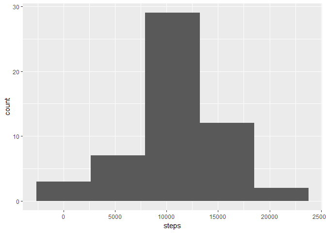
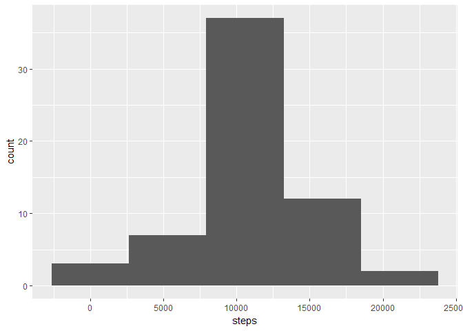
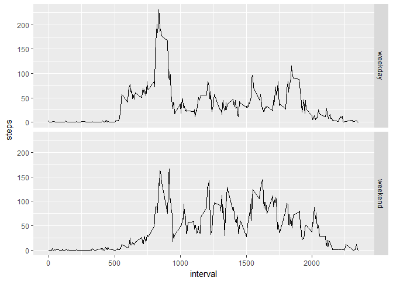

# Reproducible Research: Peer Assessment 1
Zacarías Ojeda  
September 28, 2017  


## Loading and preprocessing the data

#### Load the data

```r
activity_zip <- unzip("activity.zip")
activity <- read.csv(activity_zip)
rm(activity_zip)
```

#### Process/transform the data into a format suitable for analysis

```r
## setting date format
activity$date <- as.Date(activity$date)

str(activity)
```

```
## 'data.frame':	17568 obs. of  3 variables:
##  $ steps   : int  NA NA NA NA NA NA NA NA NA NA ...
##  $ date    : Date, format: "2012-10-01" "2012-10-01" ...
##  $ interval: int  0 5 10 15 20 25 30 35 40 45 ...
```


## What is mean total number of steps taken per day?

#### Calculate the total number of steps taken per day


```r
steps_by_date <- activity %>%
    group_by(date) %>%
    summarize(steps = sum(steps))
```
#### Histogram of the total number of steps taken each day

```r
ggplot(steps_by_date, aes(steps)) +
  geom_histogram(bins = 5)
```

```
## Warning: Removed 8 rows containing non-finite values (stat_bin).
```



#### Calculate and report the mean and median of the total number of steps taken per day

```r
mean_steps_by_date <- mean(steps_by_date$steps, na.rm = TRUE)
median_steps_by_date <- median(steps_by_date$steps, na.rm = TRUE)
c(mean_steps_by_date, median_steps_by_date)
```

```
## [1] 10766.19 10765.00
```
The mean total number of steps taken per day is **10766.19** and the median is **10765**


## What is the average daily activity pattern?


```r
average_pattern <- activity %>%
    group_by(interval) %>%
    summarize(steps = mean(steps, na.rm = TRUE))
```
#### Time series plot of the average number of steps taken

```r
ggplot(average_pattern, aes(interval, steps)) + geom_line()
```

<!-- -->

#### The 5-minute interval that, on average, contains the maximum number of steps

```r
max_interval <- average_pattern$interval[which.max(average_pattern$steps)]
max_interval
```

```
## [1] 835
```
The interval that, on average, contains the maximum number of steps is **835**


## Imputing missing values

#### Calculate and report the total number of missing values in the dataset (i.e. the total number of rows with NAs)

```r
missing_values <- is.na(activity$steps)
```

The total number of missing values in the dataset is **2304**

#### Devise a strategy for filling in all of the missing values in the dataset
In order to fill missing data we can take the mean of steps on each interval and apply it to all NAs in steps

#### Create a new dataset that is equal to the original dataset but with the missing data filled in

```r
filled <- data.frame(activity)

for(missingStepRow in which(missing_values)) {
  interval <- filled[missingStepRow, 3]
  interval_avg <- average_pattern[average_pattern$interval==interval, 2]
  filled[missingStepRow, 1] <- interval_avg
}
```

#### Calculate the total number of steps taken per day in filled dataset


```r
filled_steps_by_date <- filled %>%
    group_by(date) %>%
    summarize(steps = sum(steps))
```

#### Histogram of the total number of steps taken each day in filled dataset

```r
ggplot(filled_steps_by_date, aes(steps)) +
  geom_histogram(bins = 5)
```



#### Calculate and report the mean and median of the total number of steps taken per day in filled dataset

```r
filled_mean_steps_by_date <- mean(filled_steps_by_date$steps, na.rm = TRUE)
filled_median_steps_by_date <- median(filled_steps_by_date$steps, na.rm = TRUE)
c(filled_mean_steps_by_date, filled_median_steps_by_date)
```

```
## [1] 10766.19 10766.19
```
The mean total number of steps taken per day is **10766.19** and the median is **10766.19**. The mean is the same as before imputing missing data, but the median has changed and now it has the same value as the mean.


## Are there differences in activity patterns between weekdays and weekends?

#### Create a new factor variable in the dataset with two levels – “weekday” and “weekend” indicating whether a given date is a weekday or weekend day


```r
filled$daytype <- weekdays(filled$date) %in% c("Saturday", "Sunday")
filled$daytype <- factor(filled$daytype, labels = c('weekday', 'weekend'))
```

#### Make a panel plot containing a time series plot of the 5-minute interval (x-axis) and the average number of steps taken, averaged across all weekday days or weekend days (y-axis)


```r
average_pattern_by_daytype <- filled %>%
    group_by(daytype, interval) %>%
    summarize(steps=mean(steps))
```


```r
ggplot(average_pattern_by_daytype, aes(interval, steps)) + geom_line() + facet_grid(daytype ~ .)
```

<!-- -->

Here we can observe that, as expected, activity (steps) starts earlier on weekdays, but ends later on weekends.

